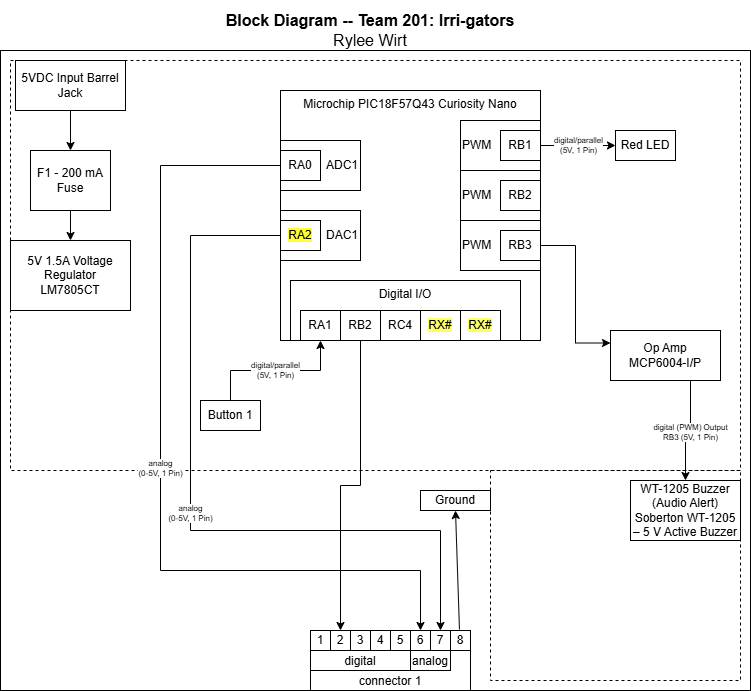

---
Individal Block Diagram
---

## Overview
This block diagram shows my design for a speaker system for Team 201: The Irri-gators water system product. The Microchip pic18F57Q43 Curiosity Nano Board processes input from the 8-pin connector, which then sends a signal to the op amp for amplification, then to the speaker for sound generation. There's a 5 volt 1.5 amp voltage regulator to provide a consistent and stable power source for the components. Also included is a button and LED for testing purposes. Overall, this diagram shows how the system works, how it's tested, and how it's designed to integrate into the rest of my teams systems. 

## Block Diagram 
 

