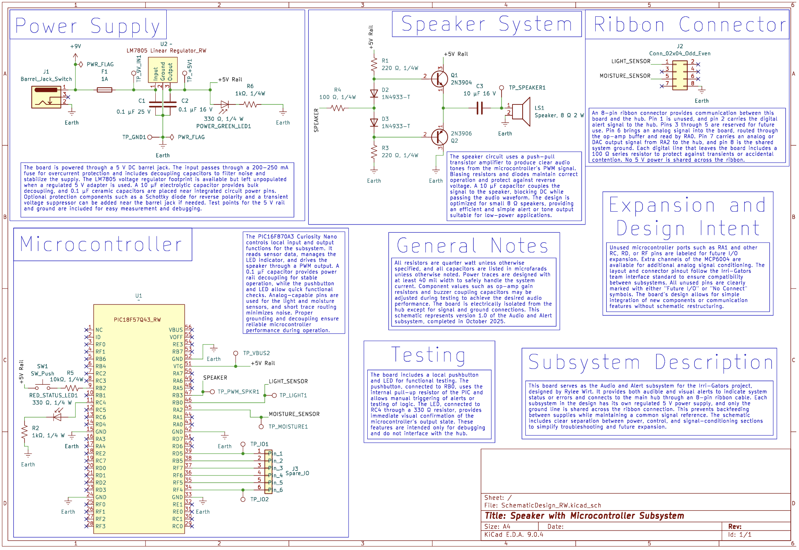

## Overview

This schematic represents the Audio and Alert subsystem for Team 201’s Irri-Gators project. The subsystem provides both audible and visual feedback to indicate system status, alerts, or potential faults within the irrigation system. It operates from a regulated 5 V supply and includes a Microchip PIC18F57Q43 microcontroller, a discrete push pull transistor driver for the speaker, indicator LEDs, sensor inputs, and a ribbon connector that links the subsystem to the rest of the design.
 

Power is supplied through a 9 V DC barrel jack and passes through a fuse for overcurrent protection. The LM7805 voltage regulator footprint is included for compatibility with future unregulated sources, but with a regulated supply it is bypassed. Input and output capacitors stabilize the 5 V rail and help reduce noise. Test points are provided for ground and the 5 V line to support measurement and debugging during development.
 

The microcontroller receives the regulated 5 V supply and manages all input and output functions. It communicates with the main hub through an 8 pin ribbon connector that carries the light sensor signal, moisture sensor signal, PWM output, and ground. Local I/O include an LED on RC4 for visual status feedback, a pushbutton on RA5 for manual testing, and dedicated test points for PWM and digital signals.
 

The speaker is driven by a complementary 2N3904 and 2N3906 transistor pair arranged in a push pull configuration. The microcontroller generates a PWM signal that controls the driver through a base resistor network. A coupling capacitor is used to block DC and deliver only the AC audio content to the speaker, while diodes protect the transistors from inductive transients produced by the speaker. This circuit allows the microcontroller to produce clear audible alerts without exposing the I/O pin to excessive current.
 

The ribbon connector transfers the subsystem’s sensor inputs and alert output to the hub while keeping the power domains isolated. Only ground is shared between boards to maintain consistent reference levels. This structure ensures that each subsystem remains electrically independent while still supporting reliable communication.
 

Overall, the schematic supports the required audio and alert functions while remaining simple, robust, and compatible with the Irri-Gators architecture. The design offers stable operation from a regulated 5 V supply, clear organization of signal paths, and room for expansion through unused pins and accessible test points.

## Resouces

The schematic as a PDF download is available [*here*](https://raw.githubusercontent.com/rmwirt-source/rmwirt-source.github.io/main/docs/04-Schematic/SchematicDesign_RW.pdf).
The schematic as a .zip download is available [*here*](https://raw.githubusercontent.com/rmwirt-source/rmwirt-source.github.io/main/docs/04-Schematic/SchematicDesign_RW.zip).

