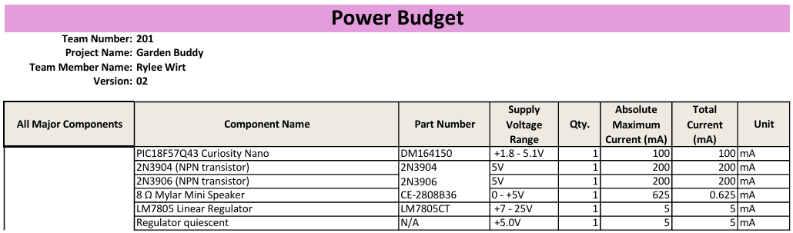
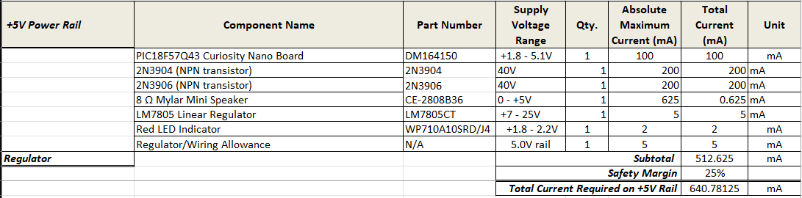
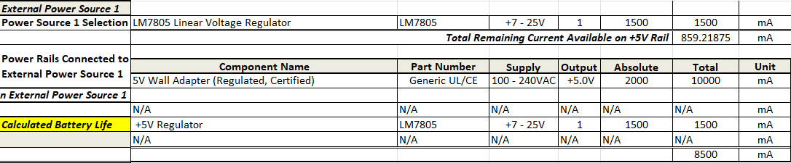

## Overview
This power budget identifies the amount of power that my subsystem requires and confirms that the selected power source safely meets the needs of the Audio and Alert subsystem. Each component in the design was reviewed to determine its maximum current draw including the PIC18F57Q43 microcontroller, the 2N3904 and 2N3906 transistors used in the speaker driver, the indicator LED, and the support circuitry.

My subsystem operates entirely from a regulated 5 V rail and is powered by a 5 V, 2 A wall adapter. The tables shown below outline the current requirements for each part of the design. A 25 percent safety margin is applied to account for worst case operating conditions. Based on these calculations the total subsystem current remains well below the limits of the power supply.

The transistor based speaker driver replaces the previous op amp design and draws significantly less current in steady state. The speaker itself draws short bursts of higher current when generating alert tones, but these pulses remain within the safe limits of the supply and the wiring allowances included in the budget.

 

---

## Power Budget Explanation

The purpose of the power budget is to verify that all components in the Speaker Subsystem can operate safely from the selected 5 V power source. To complete this budget I gathered maximum current values from datasheets and used worst case estimates to ensure that the subsystem remains reliable under full load. Each component in the design was evaluated including the PIC18F57Q43 microcontroller, the complementary transistor driver, the speaker, the indicator LED, and the support circuitry.

The PIC18F57Q43 has a small and predictable current draw during active operation which makes it straightforward to model. The LED and pushbutton contribute very little current and their values were taken from typical operating conditions. The speaker produces short bursts of higher current when generating tones so its value represents the largest contribution to the budget. The transistor driver that replaced the original op amp design draws significantly less current in steady state since it does not require continuous bias current to operate.

Once these values were summed and the required safety margin was added the total current remained well below the 2 A limit of the regulated 5 V wall adapter used to power the subsystem. Because the subsystem receives power from a regulated 5 V supply during normal operation the LM7805 footprint on the PCB is not used and does not affect the power budget. This simplifies the analysis since no voltage conversion losses need to be included.

The completed power budget shows that the Speaker Subsystem has ample electrical headroom and can operate safely without overloading the supply. The available margin ensures stable behavior during testing and during full system integration even when the speaker produces repeated alert tones.

---

## Conclusions

The updated power budget confirms that the Speaker Subsystem requires far less current than the 5 V, 2 A power supply can deliver. The PIC18F57Q43 and indicator components draw only small amounts of current during normal operation and the speaker produces higher current only in short pulses when alerts are active. Even with a 25 percent safety margin applied the total current is roughly 200 mA which leaves significant overhead for reliable performance.

Since the subsystem operates entirely from a regulated 5 V source and no higher voltage conversion is required the design remains efficient and simple. All components receive stable power without approaching the limits of the supply and the margins included in the design provide confidence that the subsystem will remain dependable under real world conditions.

This analysis verifies that the subsystem meets its power requirements and that no changes are needed in the final design.

---

## Resources

The power budget is available as a PDF download [here](https://raw.githubusercontent.com/rmwirt-source/rmwirt-source.github.io/main/docs/05-Power-Budget/PowerBudgetRW_V5.pdf).  
The Microsoft Excel version is available [here](https://raw.githubusercontent.com/rmwirt-source/rmwirt-source.github.io/main/docs/05-Power-Budget/PowerBudgetRW_V5.xlsx).

