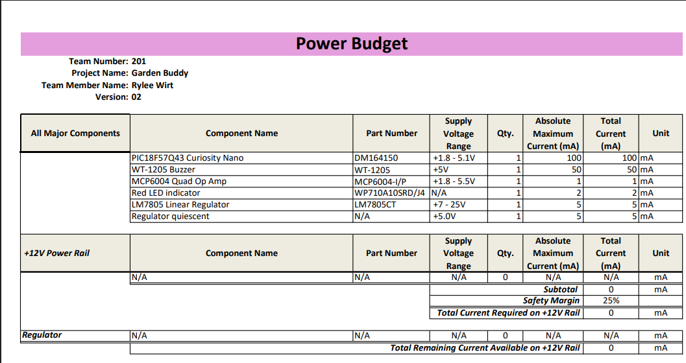
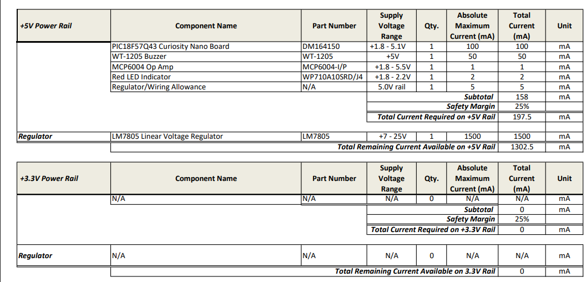
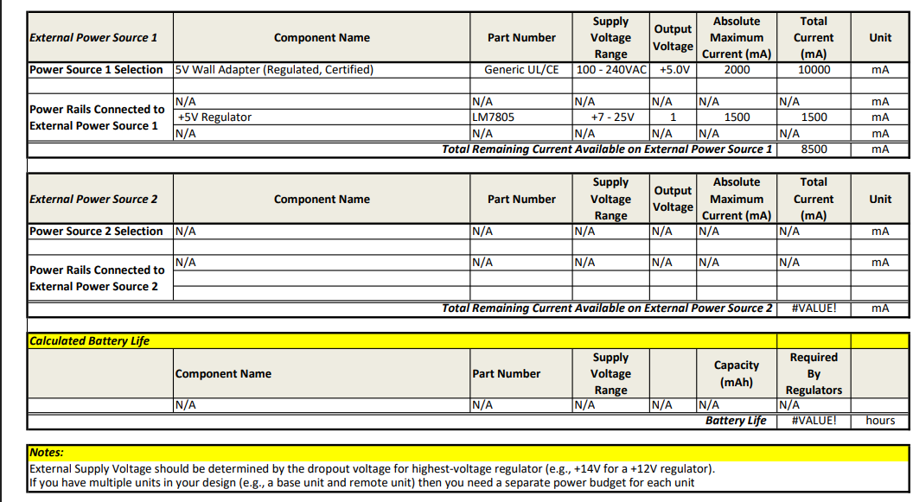

## Overview
This power budget identifies the amount of power that my subsystem requires and confirms that the selected power source and regulators safely meet the needs for my system. For my power budget I went through the various components of my design and found the amperage for each component, from there I calculated the maximum current draw of each major component, including the picrocontroller, op amp, LED, and speaker. I then added a 25% safety margin to ensure that under worse-case conditions nothing would be damaged.
   
My subsystem uses only a +5 V rail and is powered by a 5 V, 2 A wall adapter. The spreadsheet seen below shows each power rail, regulator, and external power source. From there I identified that the wall adapter can provide more than enough current for the systems total draw of about 0.68 A (676 mA). This process ensures that each component will recieve consistent power without overloading the supply or regulator.

## Conclusions

From preparing the Power Budget, I confirmed that my subsystem's power requirements are very well within safe operating limits. The wall adapter provides plenty of extra resources, even when the speaker and components operate at full output. No 12 V or 3.3 V rails are used, therefore it simplifies the design and reduces the chance for potential power conversion losses.
  
By completing this power budget I now have more of an understanding of how current, voltage, and power interact in my system. It gave me confidence that the subsystem will remain stable and efficient during thesting and intergration with the rest of my team's system.

## Resouces

The power budget as a PDF download is available [*here*](https://github.com/rmwirt-source/rmwirt-source.github.io/blob/main/docs/05-Power-Budget/PowerBudgetRW_V2.pdf)
, and a Microsoft Excel Sheet [*here*](https://github.com/rmwirt-source/rmwirt-source.github.io/blob/main/docs/05-Power-Budget/PowerBudgetRW_V2.xlsx)
.
