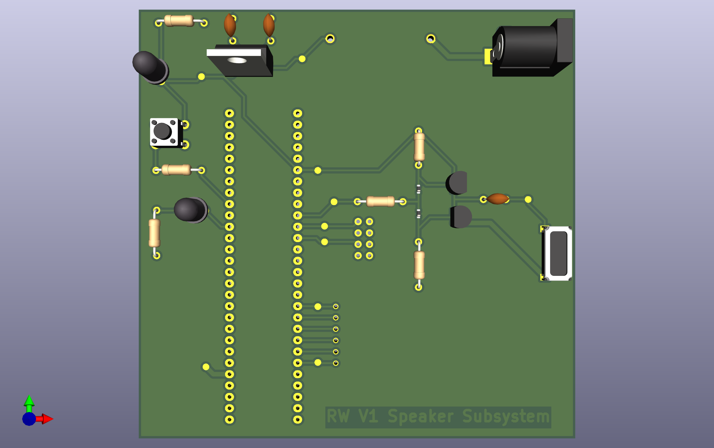
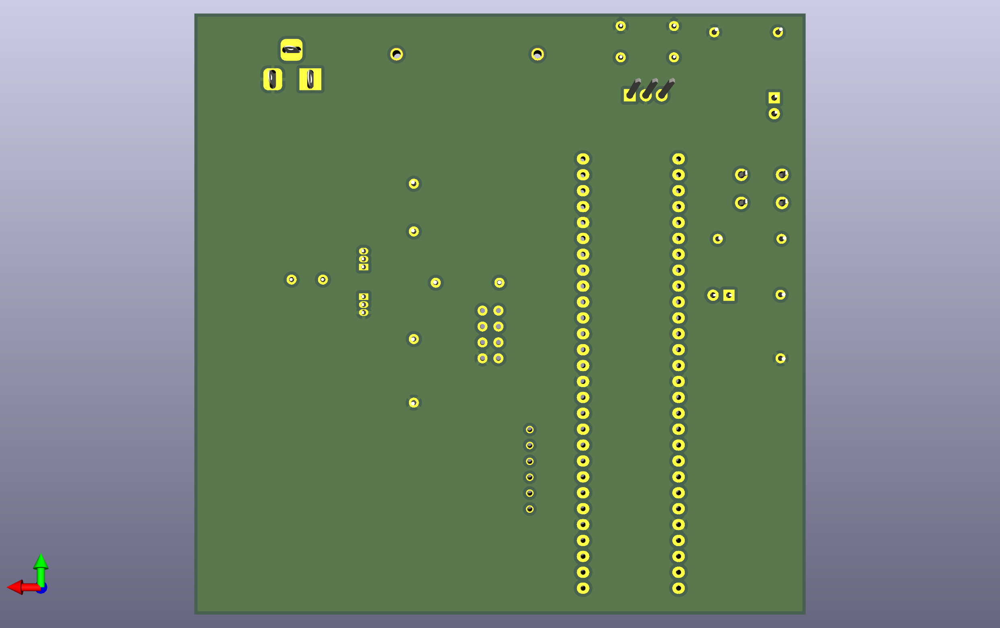

## Overview

This PCB implements the Audio and Alert subsystem for Team 201’s Garden Buddy project. The board includes the PIC18F57Q43 Curiosity Nano footprint, the complementary 2N3904 and 2N3906 transistor driver stage, and an AC-coupled 8 Ω speaker output. A 9 V barrel jack provides power to the onboard LM7805 regulator, which generates the regulated 5 V rail used throughout the subsystem. Local components such as the LED indicator, test button, and supporting passive elements are placed for straightforward debugging and accessibility.
 

The layout prioritizes short signal paths between the PWM output and the transistor driver, clear isolation between the high-current speaker path and logic signals, and wide traces on the 5 V and speaker lines to handle transient current demand. Test points for 5 V and ground are included to simplify probing during troubleshooting. The board is designed for manufacturability, with clear silkscreen labeling and spacing that supports soldering, inspection, and student-level assembly.
 

  

## Resouces

The PCB as a PDF download is available [*here*](https://raw.githubusercontent.com/rmwirt-source/rmwirt-source.github.io/main/docs/06-PCB/SchematicDesign_RW.pdf).
  
The Project as a .zip file with the ECAD files and Gerber files is available [*here*](https://raw.githubusercontent.com/rmwirt-source/rmwirt-source.github.io/main/docs/06-PCB/SchematicDesign_RW.zip).
