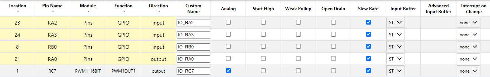

## Overview
This page contains the full firmware, pinout table, MCC configuration screenshot, and the downloadable MPLAB X project for the Audio and Alert Subsystem. The subsystem uses the PIC18F57Q43 Curiosity Nano to generate PWM tones and process sensor signals for light and moisture detection.

On startup the system emits a confirmation beep and flashes the LED to show that the device is powered. The firmware monitors two sensor inputs. The light sensor on RA2 is active high and triggers a three beep alert when a rising edge is confirmed. The moisture sensor on RB0 is active low and triggers a two beep alert when a falling edge is confirmed. After any alert the firmware waits for both sensors to return to idle before rearming.

This page also documents which microcontroller pins are used by the subsystem so the code and hardware can be reproduced.

---

## Pinout Table
The following table lists the PIC18F57Q43 pins used in this subsystem along with their direction and purpose.

| PIC Pin | Port/Bit | Direction | Function | Subsystem Role | Notes |
|---------|----------|-----------|----------|----------------|-------|
| RA2     | PORTAbits.RA2 | Input | Light sensor input | Detects high level light events | Configured as digital input in TRIS and ANSEL |
| RB0     | PORTBbits.RB0 | Input | Moisture sensor input | Detects low level moisture events | Internal weak pull up enabled |
| RC7     | LATCbits.LATC7 | Output | PWM audio output | Drives PWM tone to the speaker driver | Uses PWM1 16BIT module |
| RC4     | LATCbits.LATC4 | Output | LED indicator | Provides heartbeat and ready feedback | Active low LED |
| VDD/GND | Power pins | Power | Supply rails | Provide regulated 5 V power and ground | Powered from 5 V adapter |

---

## MCC Pin Configuration Screenshot



The screenshot above shows the final MCC pin configuration used for the subsystem. It includes all input and output assignments that appear in the firmware.

---

## Full Source Code
The complete firmware is shown below. This is the same version included in the downloadable MPLAB X project zip file.
```
/* Sensors: RA2 (light, active HIGH), RB0 (moisture, active LOW)
   - Light: beep on confirmed rising edge (0->1)
  - Moisture: beep on confirmed falling edge (1->0) -- only when it goes to 0V
   - Uses PWM1_16BIT on RC7 for tone, LED on RC4 (active-low)
   - After any beep, requires idle state (RA2=0, RB0=1) stable before re-arming
   - Monitoring is split into two alternating loops: light-monitor and moisture-monitor
*/
#include "mcc_generated_files/system/system.h"
#include "mcc_generated_files/pwm/pwm1_16bit.h"
#include <xc.h>
#include <stdint.h>

/* Pin helpers */
#define LIGHT_PIN PORTAbits.RA2   /* light sensor - active HIGH (beep when it goes to 1) */
#define MOIST_PIN PORTBbits.RB0   /* moisture sensor - active LOW (beep when it goes to 0) */
#define SPEAKER_LAT LATCbits.LATC7
#define LED_LAT LATCbits.LATC4    /* active-low LED: 0 = ON */

/* PWM control helpers */
static void startTonePWM(void) {
    PWM1_16BIT_Enable();
}
static void stopTonePWM(void) {
    PWM1_16BIT_Disable();
    SPEAKER_LAT = 0;
}

/* variable ms delay using repeated __delay_ms(1) calls (compile-time constant) */
static void delay_ms_var(uint16_t ms) {
    while (ms--) {
        __delay_ms(1);
    }
}

/* Read pin adapters */
static uint8_t read_light_pin(void) { return (LIGHT_PIN) ? 1u : 0u; }
static uint8_t read_moist_pin(void) { return (MOIST_PIN) ? 1u : 0u; }

/* Confirm an edge by sampling pin N times spaced by 'ms' and requiring all samples match expected state.
   This reduces false triggers from noise. Uses delay_ms_var() for variable spacing. */
static uint8_t confirm_pin_state(uint8_t (*read_pin)(void), uint8_t expected_state, uint8_t samples, uint16_t ms_between) {
    for (uint8_t i = 0; i < samples; ++i) {
        if (read_pin() != expected_state) return 0u;
        delay_ms_var(ms_between);
    }
    return 1u;
}

/* Rising-edge confirmation for light */
static uint8_t is_rising_edge_confirmed(uint8_t prev, uint8_t cur) {
    if (prev == 0u && cur == 1u) {
        /* require cur==1 for 3 samples spaced 10ms => ~30ms stable high */
        return confirm_pin_state(read_light_pin, 1u, 3u, 10u);
    }
    return 0u;
}

/* Falling-edge confirmation for moisture (made stricter to avoid spurious triggers) */
static uint8_t is_falling_edge_confirmed(uint8_t prev, uint8_t cur) {
    if (prev == 1u && cur == 0u) {
        /* require cur==0 for 8 samples spaced 15ms => ~120ms stable low */
        return confirm_pin_state(read_moist_pin, 0u, 8u, 15u);
    }
    return 0u;
}

/* Beep helpers & patterns */
static void beep_short(uint16_t on_ms, uint16_t off_ms) {
    startTonePWM();
    delay_ms_var(on_ms);
    stopTonePWM();
    delay_ms_var(off_ms);
}
static void beep_pattern_light(void) {
    for (uint8_t i = 0; i < 3; ++i) {
        beep_short(200, 120); /* 200ms on, 120ms off */
    }
}
static void beep_pattern_moisture(void) {
    for (uint8_t i = 0; i < 2; ++i) {
        beep_short(1000, 300); /* 1s on, 300ms off */
    }
}

/* require both inputs at idle: LIGHT=0 and MOIST=1 for N consecutive samples */
static uint8_t require_idle_stable(uint8_t samples_required, uint8_t max_attempts) {
    uint8_t samples = 0u, attempts = 0u;
    while (attempts < max_attempts) {
        if ((LIGHT_PIN == 0) && (MOIST_PIN == 1)) {
            ++samples;
            if (samples >= samples_required) return 1u;
        } else {
            samples = 0u;
        }
        ++attempts;
        delay_ms_var(20);
    }
    return 0u;
}

int main(void) {
    uint8_t prev_light, prev_moist;
    uint8_t cur_light, cur_moist;
    uint8_t ok;

    SYSTEM_Initialize();

    /* Ensure PWM module init and PWM off */
    PWM1_16BIT_Initialize();
    PWM1_16BIT_Disable();
    SPEAKER_LAT = 0;

    /* Make ports digital and directions */
    ANSELA = 0x00;
    ANSELB = 0x00;
    ANSELC = 0x00;

    TRISAbits.TRISA2 = 1;  /* light input */
    TRISBbits.TRISB0 = 1;  /* moisture input */
    TRISCbits.TRISC7 = 0;  /* PWM output */
    TRISCbits.TRISC4 = 0;  /* LED output */

    /* Optional: enable internal weak pull-up on RB0 to reduce floating noise.
       If you prefer external pull-up or none, remove these two lines. */
    WPUBbits.WPUB0 = 1;       /* enable pull-up for RB0 */

    LED_LAT = 1;  /* LED off (active-low) */

    /* Startup: quick LED flash + 1s clean PWM beep */
    LED_LAT = 0; delay_ms_var(120); LED_LAT = 1;
    startTonePWM(); delay_ms_var(1000); stopTonePWM();
    delay_ms_var(150);

    /* Require idle stable (LIGHT=0, MOIST=1) before arming triggers */
    ok = require_idle_stable(8u, 40u); /* ~160ms consecutive idle */
    if (!ok) {
        /* If not idle, snapshot current states to avoid immediate trigger */
        prev_light = (LIGHT_PIN) ? 1u : 0u;
        prev_moist = (MOIST_PIN) ? 1u : 0u;
    } else {
        prev_light = 0u;   /* expected idle: light=0 */
        prev_moist = 1u;   /* expected idle: moist=1 */
    }

    /* Ready indication */
    LED_LAT = 0; delay_ms_var(80); LED_LAT = 1; delay_ms_var(80);
    LED_LAT = 0; delay_ms_var(80); LED_LAT = 1;

    /* --- Alternating monitor loops ---
       Each monitoring section runs for up to MONITOR_CYCLES iterations (20ms each)
       or exits early on an event. This simulates two dedicated loops while staying single-threaded.
    */
    const uint8_t MONITOR_CYCLES = 25u; /* 25*20ms = ~500 ms per-monitor timeslice */

    while (1) {
        /* ------------------ Light-monitor loop ------------------ */
        uint8_t cycle = 0u;
        while (cycle < MONITOR_CYCLES) {
            /* LED heartbeat specific to light-monitor: mirror light pin for quick visual debug */
            if (LIGHT_PIN) {
                LED_LAT = 0; /* LED ON while light is HIGH */
            } else {
                LED_LAT = 0; delay_ms_var(100); LED_LAT = 1; delay_ms_var(300);
            }

            /* Read pins */
            cur_light = (LIGHT_PIN) ? 1u : 0u;
            cur_moist = (MOIST_PIN) ? 1u : 0u; /* read to keep prev_moist updated if needed */

            /* Light detection */
            if (is_rising_edge_confirmed(prev_light, cur_light)) {
                /* light sensor event */
                beep_pattern_light();

                /* After beep, require stable idle (light=0, moist=1) before rearm */
                ok = require_idle_stable(8u, 200u); /* wait up to ~4s */
                if (ok) {
                    prev_light = 0u;
                    prev_moist = 1u;
                } else {
                    prev_light = cur_light;
                    prev_moist = cur_moist;
                }
                break; /* break out of light-monitor to go to moisture-monitor next */
            }

            /* Update previous states */
            prev_light = cur_light;
            prev_moist = cur_moist;

            delay_ms_var(20);
            ++cycle;
        }

        /* ------------------ Moisture-monitor loop ------------------ */
        cycle = 0u;
        while (cycle < MONITOR_CYCLES) {
            /* For moisture-monitor we can show a different LED heartbeat (short blink) */
            LED_LAT = 0; delay_ms_var(40); LED_LAT = 1; delay_ms_var(160);

            /* Read pins */
            cur_light = (LIGHT_PIN) ? 1u : 0u;  /* read to keep prev_light updated if needed */
            cur_moist = (MOIST_PIN) ? 1u : 0u;

            /* Moisture detection (falling edge) */
            if (is_falling_edge_confirmed(prev_moist, cur_moist)) {
                /* moisture sensor event (confirmed falling to 0V) */
                beep_pattern_moisture();

                /* After beep, require stable idle (light=0, moist=1) before rearm */
                ok = require_idle_stable(8u, 200u); /* wait up to ~4s */
                if (ok) {
                    prev_light = 0u;
                    prev_moist = 1u;
                } else {
                    prev_light = cur_light;
                    prev_moist = cur_moist;
                }
                break; /* break out to return to light-monitor next */
            }

            /* Update previous states */
            prev_light = cur_light;
            prev_moist = cur_moist;

            delay_ms_var(20);
            ++cycle;
        }

        /* loop repeats: back to light-monitor */
    }

    return 0;
}
```

<br>

The Project as a .zip file is available [*here*](https://raw.githubusercontent.com/rmwirt-source/rmwirt-source.github.io/main/docs/07-Code/SpeakerSubsystem_V1.zip).
